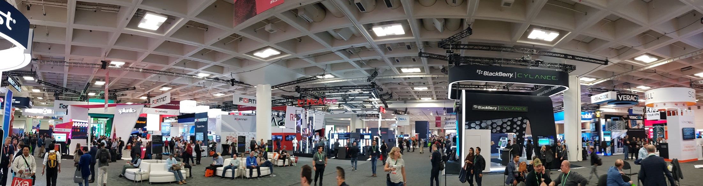

Do Not Fly Blindly Into the Light

Why the most obvious markets for security technology may not be the best

It’s hard not to feel tiny while descending the escalator to the 37-foot high subterranean expo floor of the Moscone Center, which encompasses two city blocks of prime San Francisco real estate. It’s also hard not to feel envious of the companies that signal their success here at the RSA Security Conference; their wealth affords them multi-story demo huts, armies of sales people, and swanky parties.

I am inconsequential among the roughly 50,000 people who work for companies successful enough to buy or sell in this marketplace of vast riches. I flew to RSA using the frequent-flyer miles my wife earned traveling for her demanding corporate job. I’m staying at the home of a former intern, his wife, and their toddler, who wakes up screaming at 2:30am. Despite being over a year into my new venture, I arrive with no sales team or employees. I acquired the cheapest-possible badge, an *expo pass*, which renders me ineligible for the otherwise-ubiquitous official conference swag. The expo pass also signals my membership in the conference's lowest caste.

I cannot blame youth or inexperience for my inconsequence. I received a PhD in computer security from a name-brand university way back in 2004, with a dissertation on bug bounties that foresaw the founding of some of the biggest vendors here. I performed security research alongside name-brand colleagues at two name-brand institutions for well over a decade. I have been featured with my work in articles at name-brand news outlets. I have mentored students who became professors at names-brand universities, CISOs of name-brand companies, and successful startup founders.

I wear my *expo pass* of shame because I have chosen to build security solutions for individual people: mere *consumers* in the dismissive lexicon of modern business. Consumer security solutions are conspicuously absent here, and so it’s tempting to conclude that the market for these solutions is as inconsequential as I am.  Having descended this same escalator last year, how have I managed to dismiss all the bright lights on the expo floor, the bustle of activity they lead to, and all the riches in sight that prove the money in the security business lies in selling to businesses and government?  Has my dream of helping actual people seduced me into a terrible market?

The fallacy of dismissing the market for consumer security solutions because of its absence at the RSA conference is that the consumer market *should* be absent here, *regardless* of its size. No individual should spend thousands of dollars and a week of their time to shop at RSA for personal security solutions—they could buy almost any bundle of consumer security solutions they needed for fraction price and make better use of their time. Without buyers for consumer security solutions at RSA, there’s no reason for sellers to be here either.

Rather, would-be security entrepreneurs should not let the light pollution on RSA's expo floor hinder their view of other markets. Fierce competition awaits entrepreneurs who fly like moths into the bright lights of business and government sales, and standing out in those markets is expensive; real estate on the expo floor, sales people, and swanky parties are not cheap. These table stakes will require most entrants to raise venture capital, and their investors will in turn require these entrants to grow rapidly or die trying.

In contrast, if you choose to build security solutions for consumers, you can experiment with more affordable sales approaches. You may be able to do so on a more forgiving schedule by avoiding investment, delaying it, or burning it more slowly. You will likely have to work harder to identify the necessary ingredients for your sales recipe than startups that follow a tried-and-true business-to-business sales formula, but you are likely to face less competition for those ingredients once you have identified them. For example, you can experiment with crowdfunding campaigns; you can work with existing business-to-consumer (B2C) businesses outside the security space that stand to benefit if your solutions keep their customers safe; you can partner directly with complementary brands to bundle products together. If you need to revise your sales approach, you can iterate without having to wait for the next big sales conference.

Founders of consumer security startups may still attend conferences like RSA to network with potential hires, advisers, influencers, and members of the press. Wearing badges that signal your role as invisible (or at least inconsequential) is a small price to pay. While your eyes may give you envy as they take in the lights of the expo floor, your nose will soon pick up the nervous scent of those whose future is riding on their investments in that extravagant real estate.

---

**Stuart Schechter** is the founder of *DiceKeys*, a consumer-focused authentication startup. He wrote this article using time that he should have used to build a website to describe what DiceKeys are. He sometimes tweets [@uppajung](https://twitter.com/uppajung), but acquired fewer social media followers over his career than his 14-year-old daughter has in the past year.
